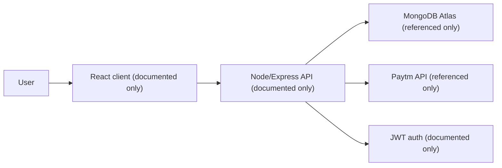
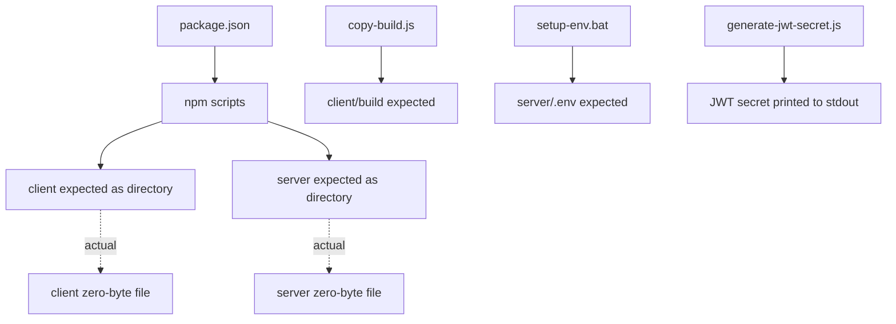
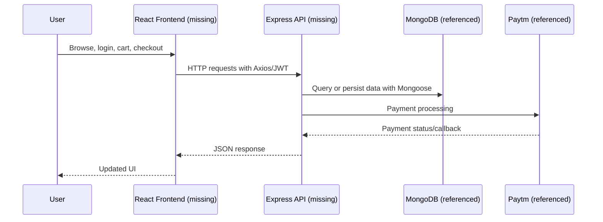
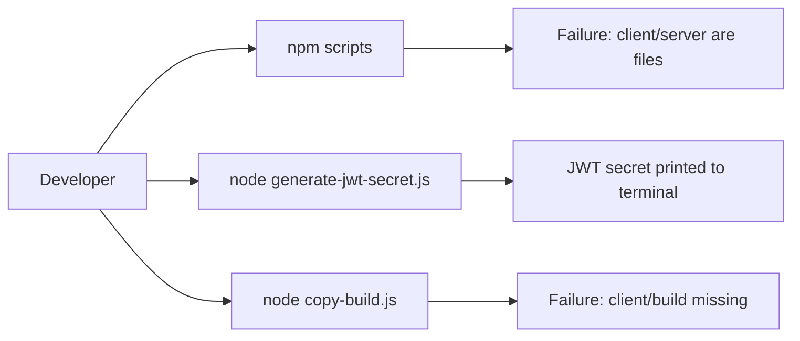
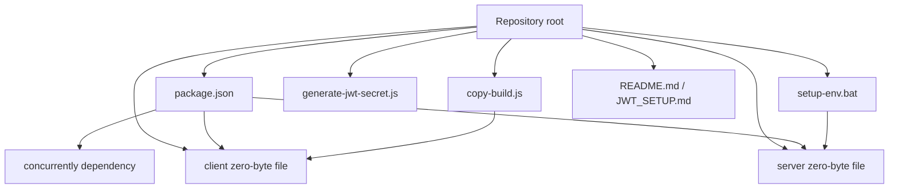
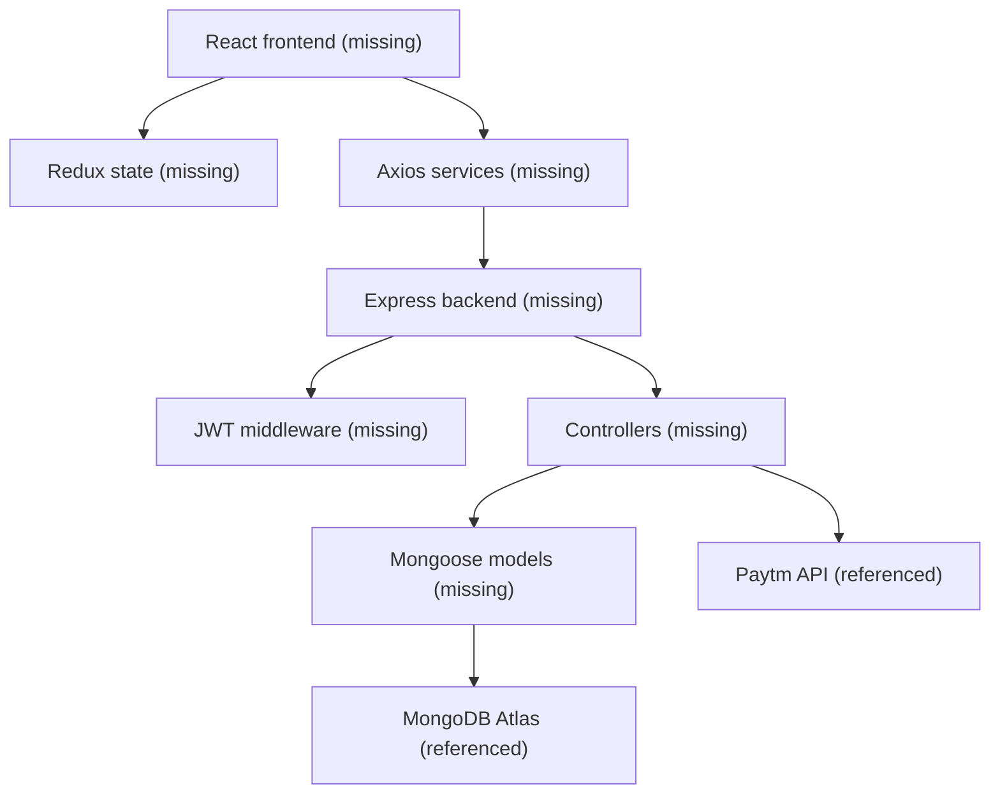
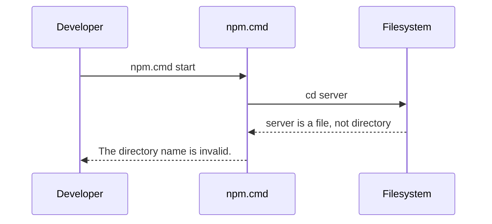

# Codebase Audit

Audit date: 2026-07-24  
Repository root: `C:\Users\rio51\OneDrive\Desktop\E-Commerce`  
Current branch: `main`  
Current HEAD: `11168b0 Remove author information from README`

This audit is based on the repository exactly as it exists in the working tree and tracked Git `HEAD`. It does not assume the application described in documentation exists unless source files are present in this checkout. The repository currently contains only root-level metadata, documentation, two utility scripts, one batch setup script, and two zero-byte files named `client` and `server`.

## 1. Executive Summary

This repository is presented by `package.json` and `README.md` as a full-stack e-commerce website with a React frontend, Node.js/Express backend, MongoDB database, JWT authentication, and Paytm payment integration. However, the actual checked-out repository does not contain any frontend application source, backend application source, database models, routes, controllers, middleware, tests, Docker files, CI workflows, deployment configuration files, or infrastructure definitions.

The current architecture is therefore not an implemented application architecture. It is a root-level shell around an intended full-stack project:

- `package.json` defines orchestration scripts that expect `client/` and `server/` directories.
- `README.md` and `JWT_SETUP.md` document a much larger intended project.
- `copy-build.js` expects a React build output at `client/build`.
- `generate-jwt-secret.js` generates a random JWT secret.
- `setup-env.bat` writes a server `.env` file containing database credentials.
- `client` is a zero-byte file, not a directory.
- `server` is a zero-byte file, not a directory.

Current maturity level: pre-implementation or broken checkout. The repository is not runnable as a web application in its current state.

Main technologies actually present:

- JavaScript / Node.js scripts
- npm package manifest
- Git
- Windows batch scripting
- Markdown documentation

Main technologies documented but not implemented in this checkout:

- React
- Material UI
- Redux
- React Router
- Axios
- Node.js backend application
- Express
- MongoDB
- Mongoose
- JWT middleware and controllers
- Paytm API integration
- Vercel / Render deployment
- ESLint
- Testing framework

High-level assessment: the repository currently contains documentation and orchestration files for an intended e-commerce system, but the core application files are absent. The most important technical finding is the mismatch between documented architecture and tracked files. Most project scripts fail because `client` and `server` are files rather than directories.

## 2. Repository Structure

Actual current structure:

```text
E-Commerce/
├── .git/                    # Git metadata
├── CODEBASE_AUDIT.md        # This audit document
├── JWT_SETUP.md             # JWT setup guide; documents intended server/client files
├── README.md                # Project README; describes intended full-stack app
├── client                   # Zero-byte file; not a frontend directory
├── copy-build.js            # Node script to copy client/build into public/
├── generate-jwt-secret.js   # Node script to generate a JWT secret
├── package.json             # Root npm manifest and orchestration scripts
├── server                   # Zero-byte file; not a backend directory
└── setup-env.bat            # Windows batch script to generate server\.env
```

Important structure observations:

- There is no `client/` directory despite `package.json`, `README.md`, and `JWT_SETUP.md` referencing it.
- There is no `server/` directory despite the same files referencing it.
- There is no `public/` directory until `copy-build.js` creates it.
- There is no `package-lock.json`.
- There is no `.env`, `.env.example`, `.gitignore`, `Dockerfile`, `docker-compose.yml`, `.github/workflows`, `vercel.json`, `render.yaml`, database schema, migration folder, or test folder.
- Git tracks `client` and `server` as regular zero-byte files.

## 3. Technology Stack

### Actually Present

| Technology | Where Used | Purpose | Interaction |
|---|---|---|---|
| JavaScript | `copy-build.js`, `generate-jwt-secret.js`, `package.json` scripts | Utility scripts and npm orchestration | Scripts are invoked manually or by npm lifecycle commands |
| Node.js | `copy-build.js`, `generate-jwt-secret.js` | Runtime for utility scripts | Required to run build-copy and secret-generation tasks |
| npm | `package.json` | Package manager and script runner | Defines project scripts and dependency on `concurrently` |
| concurrently | `package.json` dependency | Intended to run client/server dev commands together | Used by `npm run dev`, but command fails because `client` and `server` are files |
| Windows batch | `setup-env.bat` | Creates `server\.env` | Fails in current structure because `server` is a file |
| Markdown | `README.md`, `JWT_SETUP.md`, `CODEBASE_AUDIT.md` | Documentation | Describes intended setup, features, and JWT behavior |
| Git | `.git/` | Version control | Tracks only the small root-level file set |

### Documented But Not Implemented In Current Checkout

| Technology | Documented Location | Current Status | Notes |
|---|---|---|---|
| React.js | `README.md`, intended `client/` | Missing | No frontend source exists |
| Material UI | `README.md` | Missing | No dependency manifest exists in `client` |
| Redux | `README.md` | Missing | No store/actions/reducers exist |
| React Router | `README.md` | Missing | No routing code exists |
| Axios | `README.md` | Missing | No service layer exists |
| Node.js backend | `README.md`, intended `server/` | Missing | Only root utility scripts exist |
| Express.js | `README.md` | Missing | No server entrypoint or routes exist |
| MongoDB | `README.md`, `JWT_SETUP.md`, `setup-env.bat` | Referenced only | No database connection or models exist |
| Mongoose | `README.md` | Missing | No schemas/models exist |
| JWT | `README.md`, `JWT_SETUP.md`, `generate-jwt-secret.js`, `setup-env.bat` | Partially present as utility/documentation | No auth middleware/controllers exist |
| Paytm API | `README.md` | Referenced only | No implementation files exist |
| Vercel | `README.md`, `package.json` script name | Referenced only | No `vercel.json`; `vercel-build` script exists |
| Render | `README.md`, `package.json` build env URL | Referenced only | Backend URL appears in docs/scripts |
| ESLint | `README.md` | Missing | No config file or dependency present |

## 4. Application Architecture

There is no implemented frontend/backend/database architecture in this checkout.

The intended architecture described by documentation is:



The actual current architecture is:



### Frontend Architecture

No frontend implementation exists. The `client` path is a zero-byte file, not a directory. Therefore there are no pages, layouts, components, hooks, contexts, Redux stores, routes, assets, styles, tests, or frontend package manifest.

### Backend Architecture

No backend implementation exists. The `server` path is a zero-byte file, not a directory. Therefore there are no controllers, services, repositories, models, middleware, routes, server entrypoints, background jobs, schedulers, validation layers, or server package manifest.

### API Architecture

No API routes are implemented in current files. Endpoints listed in `JWT_SETUP.md` are documented only.

### Database Architecture

No database schema, connection code, ORM/ODM model, migration, seed, or repository layer exists. MongoDB is referenced in documentation and setup scripts only.

### AI Architecture

No AI/LLM integrations exist in the current repository. There are no model calls, prompts, agents, orchestration files, memory stores, function-calling schemas, tools, structured-output definitions, retries, or guardrails.

### Deployment Architecture

Deployment is only described. `package.json` defines `vercel-build`, and `README.md` references Vercel and Render. No deployment-specific configuration files are present.

## 5. Folder-by-Folder Breakdown

### Root Folder

Purpose: contains all tracked project files. Responsibilities include documentation, npm orchestration, and utility scripts.

Important files:

- `package.json`: root metadata and scripts.
- `README.md`: describes intended e-commerce app.
- `JWT_SETUP.md`: describes intended JWT setup and includes sensitive credential examples.
- `copy-build.js`: copies a missing `client/build` directory to `public`.
- `generate-jwt-secret.js`: generates and prints a JWT secret.
- `setup-env.bat`: writes a `server\.env` file with hardcoded credentials.
- `client`: zero-byte placeholder file.
- `server`: zero-byte placeholder file.

Interactions:

- `package.json` scripts call into `client` and `server` paths as if they were directories.
- `copy-build.js` depends on `client/build`.
- `setup-env.bat` depends on `server` being a directory.

### `.git/`

Purpose: Git repository metadata. It is not application code. The current branch is `main`, remote is `https://github.com/rio-ARC/E-Commerce.git`, and tracked files match the small current file set.

### `client`

Purpose: none in current form. It is an empty file. It conflicts with intended use as a React application directory.

### `server`

Purpose: none in current form. It is an empty file. It conflicts with intended use as a Node/Express backend directory.

## 6. File-by-File Analysis

### `package.json`

Purpose: root package manifest for a project named `ecommerce-website`.

Key fields:

- `name`: `ecommerce-website`
- `version`: `1.0.0`
- `description`: claims a React frontend and Node.js backend.
- `main`: `server/index.js`, which does not exist.
- `dependencies`: only `concurrently`.

Scripts:

- `install-client`: `cd client && npm install`
- `install-server`: `cd server && npm install`
- `build-client`: `cd client && REACT_APP_API_URL=https://ecommerce-website-3-9ze3.onrender.com npm run build && cd .. && node copy-build.js`
- `build-server`: `cd server && npm run build`
- `install-all`: runs client and server installs.
- `build-all`: runs client and server builds.
- `vercel-build`: runs install and build all.
- `start`: `cd server && npm start`
- `dev`: uses `concurrently` to start client and server.

Responsibilities:

- Intended as top-level coordinator for a monorepo-style client/server application.
- Does not define actual app dependencies besides `concurrently`.

Dependencies:

- External: `concurrently`.
- Internal: assumes `client` and `server` directories with their own npm projects.

Key findings:

- Every script that enters `client` or `server` fails in current checkout because those paths are files.
- `build-client` uses Unix-style inline environment assignment (`REACT_APP_API_URL=...`) that does not work in default Windows `cmd.exe` npm execution without a cross-platform helper such as `cross-env`.
- `main` points to missing `server/index.js`.
- No lockfile is present, so dependency resolution is not pinned.

### `README.md`

Purpose: public-facing project documentation.

Responsibilities:

- Describes a full-stack e-commerce platform.
- Lists features: product browsing, cart, wishlist, product details, user registration/login, profiles, order history, address management, Paytm payments, theme toggle, responsive UI.
- Documents intended tech stack.
- Documents setup commands and environment variables.
- Documents expected folder structure.
- Documents Vercel and Render deployment URLs.

Key findings:

- Most described functionality is not implemented in current checkout.
- The first "Live Demo" frontend link is malformed: `[http://e-commerce-website-rose-pi.vercel.app/)` is missing a proper Markdown destination and closing syntax.
- The README contains mojibake/encoding artifacts in emoji and box-drawing sections, indicating the file was likely saved or interpreted with incompatible encoding.
- The documented folder tree does not match the repository.
- It references client/server scripts that cannot run because `client` and `server` are files.

### `JWT_SETUP.md`

Purpose: setup guide for an intended JWT authentication implementation.

Responsibilities:

- Tells the user to install `jsonwebtoken`.
- Instructs creating a server `.env`.
- Documents expected JWT auth behavior.
- Lists expected auth endpoints.
- Lists intended server/client file structure.

Documented endpoints:

- `POST /login`
- `POST /signup`
- `POST /logout`
- `GET /verify-token`

Key findings:

- No corresponding implementation files exist.
- The document includes concrete MongoDB credentials and a full MongoDB Atlas connection string. Even if stale or example data, this is a security risk because it resembles a real secret.
- It claims JWT features are implemented, but the implementation files are absent.
- It also contains mojibake/encoding artifacts.

### `copy-build.js`

Purpose: copies React build artifacts from `client/build` into root `public`.

Exports: none.

Responsibilities:

- Imports Node core modules `fs` and `path`.
- Creates `public` if missing.
- Recursively copies all files/directories from `client/build` to `public`.
- Exits with code `1` if `client/build` is missing.

Dependencies:

- Node built-ins: `fs`, `path`.
- Internal expected path: `client/build`.

Key logic:

- `publicDir = path.join(__dirname, 'public')`
- `buildDir = path.join(__dirname, 'client', 'build')`
- `copyRecursive(src, dest)` recursively calls `fs.statSync`, `fs.mkdirSync`, `fs.readdirSync`, and `fs.copyFileSync`.

Key findings:

- Running `node copy-build.js` currently fails with `Build directory not found!`.
- The script creates `public` before checking whether `client/build` exists. That means a failed run may still modify the repository by creating an empty `public/` directory.
- It has no cleanup for removed build files. Old files in `public` would remain if a later build omits them.
- It does not handle symlinks specially.
- It does not catch filesystem exceptions beyond the missing `buildDir` check.

### `generate-jwt-secret.js`

Purpose: generates and prints a random JWT secret.

Exports: none.

Responsibilities:

- Imports Node `crypto`.
- Generates 64 random bytes.
- Converts them to hex.
- Prints the generated value and a suggested `.env` assignment.

Dependencies:

- Node built-in: `crypto`.

Key logic:

- `crypto.randomBytes(64).toString('hex')`

Key findings:

- Running the script works on the installed Node runtime, but Node emits `[MODULE_TYPELESS_PACKAGE_JSON]` because the package does not declare `"type": "module"` while the script uses ESM `import`.
- The script is not referenced in `package.json`.
- It prints the secret to the terminal. That is acceptable for a utility, but terminal history/logging can leak generated secrets.

### `setup-env.bat`

Purpose: creates a backend `.env` file on Windows.

Responsibilities:

- Writes `DB_USERNAME`, `DB_PASSWORD`, `JWT_SECRET`, and `MONGODB_URI` to `server\.env`.
- Prints instructions for starting the server.

Dependencies:

- Windows `cmd.exe`.
- Expected `server` directory.

Key findings:

- Current repository has `server` as a zero-byte file, so writing `server\.env` would fail.
- The file contains hardcoded database credentials and a MongoDB Atlas connection string.
- The generated `JWT_SECRET` value is an obvious placeholder.
- The script does not create the `server` directory.
- The script does not protect against overwriting an existing `.env`.

### `client`

Purpose: none. It is a zero-byte regular file.

Key findings:

- It blocks creation/use of a `client/` directory until removed or renamed.
- It is incompatible with every root script that expects `cd client`.

### `server`

Purpose: none. It is a zero-byte regular file.

Key findings:

- It blocks creation/use of a `server/` directory until removed or renamed.
- It is incompatible with every root script that expects `cd server`.
- It prevents `setup-env.bat` from creating `server\.env`.

## 7. Frontend Analysis

No frontend application exists in current source.

### Routing

No frontend router exists. `README.md` mentions React Router, but no route configuration or page files are present.

### Pages

No pages exist.

### Layouts

No layouts exist.

### Reusable Components

No components exist.

### State Management

No state management implementation exists. Redux is documented only.

### Hooks

No hooks exist.

### Contexts

No React contexts exist. `JWT_SETUP.md` references `client/context/AuthContext.jsx`, but the file is absent.

### API Communication

No API service layer exists. Axios is documented only.

### Styling

No CSS, Material UI theme, style files, or styling configuration exist.

### UI Architecture

No UI architecture is implemented.

### Forms and Validation

No forms or validation code exist.

### Error Handling

No frontend error-handling code exists.

### Implemented and Missing Features

Implemented frontend features: none.

Missing documented frontend features:

- Product browsing
- Search/filtering
- Cart
- Wishlist
- Product detail views
- Login/signup UI
- Profile UI
- Order history
- Address management
- Theme toggle
- Responsive Material UI implementation

## 8. Backend Analysis

No backend application exists in current source.

### Server Setup

No server entrypoint exists. `package.json` points to `server/index.js`, but `server` is a zero-byte file.

### Routing

No routes exist.

### Controllers

No controllers exist.

### Services

No services exist.

### Repositories

No repositories exist.

### Middleware

No middleware exists. `JWT_SETUP.md` references `server/middleware/auth.js`, but the file is absent.

### Authentication

No authentication code exists.

### Authorization

No authorization code exists.

### Validation

No validation code exists.

### Business Logic

No business logic exists.

### Background Jobs and Schedulers

No job or scheduler implementation exists.

### Logging

No logging framework or application logging exists.

### Configuration

No backend configuration loader exists. Environment variables are documented and hardcoded into setup docs/scripts only.

## 9. API Documentation

No API endpoints are implemented in current source.

Documented-only endpoints from `JWT_SETUP.md`:

| Route | Method | Request Format | Response Format | Authentication | Implementation Location | Business Logic | Status |
|---|---|---|---|---|---|---|---|
| `/login` | `POST` | Not specified beyond username/password | Not specified | Public | Missing; expected `server/controller/user-controller.js` and `server/routes/route.js` | Login and JWT issuance documented | Missing |
| `/signup` | `POST` | Not specified | Not specified | Public | Missing | Register user and JWT issuance documented | Missing |
| `/logout` | `POST` | Not specified | Not specified | Client-side token removal according to docs | Missing | Logout documented as client-side cleanup | Missing |
| `/verify-token` | `GET` | Bearer token implied | Not specified | Protected | Missing; expected `authenticateToken` middleware | Verify token validity | Missing |

No product, cart, wishlist, order, payment, profile, address, or webhook endpoints are implemented in the current repository.

## 10. Database Analysis

No database implementation exists.

Documented/referenced database technology:

- MongoDB Atlas, referenced in `README.md`, `JWT_SETUP.md`, and `setup-env.bat`.
- Mongoose, referenced in `README.md`.

Actual database assets:

- No connection module.
- No schemas.
- No models.
- No migrations.
- No seed scripts.
- No indexes.
- No constraints.
- No repositories.
- No data-access utilities.

Documented environment variables:

- `DB_USERNAME`
- `DB_PASSWORD`
- `MONGODB_URI`

Data flow cannot be implemented because there is no application code connecting frontend, API, backend, or database.

## 11. Authentication & Authorization

Authentication is documented but not implemented.

Documented login flow:

- User logs in or signs up.
- Server generates JWT.
- Client stores token in `localStorage`.
- Client verifies token on app load.
- Protected routes require valid token.
- Token expires after seven days.

Actual implementation:

- No login controller.
- No signup controller.
- No JWT middleware.
- No protected route component.
- No auth context.
- No token verification endpoint.
- No session management code.
- No RBAC.
- No permission model.
- No OAuth.
- No cookie/session implementation.

Security observations:

- `JWT_SETUP.md` and `setup-env.bat` expose database credentials.
- `JWT_SETUP.md` recommends `localStorage` token storage, which is vulnerable to token theft if XSS exists in the frontend.
- No CSRF protections are needed for purely header-based JWT by default, but no actual implementation exists to assess.
- No authorization boundaries are implemented.

## 12. AI / LLM Analysis

No AI or LLM integration exists.

There are no:

- AI SDKs
- model names
- prompts
- agents
- tools
- function-calling schemas
- memory stores
- vector stores
- structured output schemas
- inference flows
- retry logic
- guardrails

## 13. External Integrations

### MongoDB Atlas

Status: referenced only.

Where:

- `README.md` setup instructions.
- `JWT_SETUP.md` `.env` example.
- `setup-env.bat`.

How it currently works: it does not. There is no database connection code.

### Paytm

Status: documented only.

Where:

- `README.md` feature list and environment variable list.

How it currently works: it does not. There is no Paytm SDK, controller, checksum handling, callback/webhook route, or order payment flow.

### Vercel

Status: referenced only.

Where:

- `README.md` deployment section.
- `package.json` `vercel-build` script.

How it currently works: the configured script would fail because `client` and `server` are files.

### Render

Status: referenced only.

Where:

- `README.md` backend API URL.
- `package.json` `build-client` environment variable.

How it currently works: no Render config exists in the repository.

## 14. Environment Variables

Environment variables referenced by documentation and scripts:

| Variable | Where Used/Referenced | Required or Optional | Purpose | Current Implementation |
|---|---|---|---|---|
| `REACT_APP_API_URL` | `package.json` `build-client` | Required for intended React build | Points frontend build to backend API | Referenced in script only |
| `DB_USERNAME` | `README.md`, `JWT_SETUP.md`, `setup-env.bat` | Required for intended backend | MongoDB username | No code uses it |
| `DB_PASSWORD` | `README.md`, `JWT_SETUP.md`, `setup-env.bat` | Required for intended backend | MongoDB password | No code uses it |
| `MONGODB_URI` | `README.md`, `JWT_SETUP.md`, `setup-env.bat` | Required for intended backend | MongoDB connection string | No code uses it |
| `JWT_SECRET` | `README.md`, `JWT_SETUP.md`, `setup-env.bat`, output from `generate-jwt-secret.js` | Required for intended JWT auth | JWT signing secret | No auth code uses it |
| `PAYTM_MERCHANT_KEY` | `README.md` | Required for intended Paytm integration | Paytm merchant key | No code uses it |
| `PAYTM_MID` | `README.md` | Required for intended Paytm integration | Paytm merchant ID | No code uses it |
| `PAYTM_WEBSITE` | `README.md` | Required for intended Paytm integration | Paytm website mode | No code uses it |
| `PAYTM_CHANNEL_ID` | `README.md` | Required for intended Paytm integration | Paytm channel | No code uses it |
| `PAYTM_INDUSTRY_TYPE_ID` | `README.md` | Required for intended Paytm integration | Paytm industry type | No code uses it |
| `PAYTM_CUST_ID` | `README.md` | Required for intended Paytm integration | Paytm customer ID | No code uses it |
| `PORT` | `README.md` | Required/optional for intended backend | Server port | No code uses it |
| `NODE_ENV` | `README.md` | Optional/common runtime variable | Runtime environment | No code uses it |

No `.env.example` exists. The repository includes hardcoded secret-like values in docs/scripts instead of safe placeholders only.

## 15. Configuration Analysis

### `package.json`

This is the only actual application configuration file. It defines root metadata, one dependency, and orchestration scripts for a missing client/server layout.

Issues:

- `server/index.js` main file does not exist.
- Client/server scripts fail because `client` and `server` are files.
- `build-client` is not cross-platform.
- No engines field specifies Node/npm versions.
- No repository, bugs, or homepage metadata.
- No lockfile.

### TypeScript

No `tsconfig.json` exists.

### ESLint

No ESLint configuration exists despite README listing ESLint.

### Prettier

No Prettier configuration exists.

### Vite

No Vite configuration exists.

### Next.js

No Next.js configuration exists.

### Docker

No `Dockerfile` or `docker-compose.yml` exists.

### Nginx

No Nginx configuration exists.

### CI / GitHub Actions

No `.github/workflows` directory exists.

### Deployment

No `vercel.json`, `render.yaml`, Procfile, Docker config, or platform-specific deployment config exists. Deployment behavior depends only on the `vercel-build` npm script, which currently fails.

## 16. Dependency Analysis

### External Dependencies

Only one runtime dependency is declared:

- `concurrently@^8.2.2`

It is used by `npm run dev` to attempt concurrent startup of the missing client and server projects.

### Internal Dependencies

Internal dependency flow:

- `package.json` depends on `client` and `server` being directories.
- `copy-build.js` depends on `client/build`.
- `setup-env.bat` depends on `server` being a directory.
- Documentation depends on an intended file structure that is absent.

### Coupling

The root scripts are tightly coupled to a specific monorepo shape. Because `client` and `server` are not directories, all meaningful lifecycle scripts are broken.

### Circular Dependencies

No source modules exist, so there are no detectable circular dependencies.

## 17. Data Flow

No implemented data flow exists.

Documented intended data flow:



Actual current data flow:



## 18. Feature Inventory

| Feature | Status | Implementation Location | Notes |
|---|---|---|---|
| Product browsing | Missing | None | Documented in README only |
| Search/filtering | Missing | None | Documented in README only |
| Shopping cart | Missing | None | Documented in README only |
| Wishlist | Missing | None | Documented in README only |
| Product details | Missing | None | Documented in README only |
| User registration | Missing | None | Documented in README/JWT guide only |
| User login | Missing | None | Documented in README/JWT guide only |
| JWT generation for auth | Missing in app; utility exists | `generate-jwt-secret.js` | Utility generates a secret, not auth tokens |
| JWT middleware | Missing | None | `JWT_SETUP.md` references missing `server/middleware/auth.js` |
| Token verification endpoint | Missing | None | Documented only |
| Protected frontend routes | Missing | None | Documented only |
| User profile | Missing | None | Documented only |
| Order history | Missing | None | Documented only |
| Address management | Missing | None | Documented only |
| Paytm payments | Missing | None | Documented only |
| Payment status tracking | Missing | None | Documented only |
| Dark/light theme | Missing | None | Documented only |
| Responsive UI | Missing | None | No UI exists |
| React app build copy | Partial | `copy-build.js` | Script exists but source build path missing |
| Dev startup | Broken | `package.json` | Fails because `client`/`server` are files |
| Server startup | Broken | `package.json` | Fails because `server` is a file |
| Environment setup | Broken/risky | `setup-env.bat` | Writes secrets to missing `server/.env`; `server` is a file |

## 19. Current Functionality

Exactly what currently works:

- `npm.cmd run` lists available root scripts.
- `node --check copy-build.js` passes syntax validation.
- `node --check generate-jwt-secret.js` passes syntax validation.
- `node generate-jwt-secret.js` generates and prints a random JWT secret. Node emits a module-type warning because the package lacks `"type": "module"`.

Exactly what currently does not work:

- `npm.cmd start` fails with `The directory name is invalid.` because `server` is a file.
- `npm.cmd run build-server` fails for the same reason.
- `npm.cmd run build-client` fails because `client` is a file.
- `node copy-build.js` fails with `Build directory not found!` because `client/build` does not exist.
- `setup-env.bat` would fail to create `server\.env` because `server` is a file.

PowerShell-specific note:

- Running `npm run` through `npm.ps1` is blocked by the system execution policy in this environment. Running `npm.cmd run` works and reveals the project scripts.

## 20. Missing Functionality

Missing modules:

- Entire frontend source tree.
- Entire backend source tree.
- API routes.
- Controllers.
- Services.
- Middleware.
- Database models.
- Payment integration.
- Authentication implementation.
- Authorization implementation.
- Tests.
- CI/CD workflows.
- Deployment config.
- Docker/infrastructure files.
- Static assets.

Placeholders and mismatches:

- `client` and `server` are zero-byte files where directories are required.
- `README.md` screenshots section contains a placeholder.
- `JWT_SETUP.md` describes files and endpoints that do not exist.
- `package.json` points to `server/index.js`, which does not exist.

Dead or currently unusable code:

- `copy-build.js` cannot complete because its input directory does not exist.
- Most npm scripts cannot execute because expected directories are absent.
- `setup-env.bat` cannot write to the intended location in the current structure.

## 21. Security Audit

### Secrets

Critical issue: `JWT_SETUP.md` and `setup-env.bat` contain hardcoded MongoDB credentials and a MongoDB Atlas URI. These should be treated as exposed secrets unless proven otherwise.

Specific risks:

- Public or shared repository exposure could compromise the database account.
- The setup script would write real-looking credentials into `.env`.
- The README instructs environment variable usage, but there is no safe `.env.example`.

### Authentication

No implemented auth exists. Documentation describes JWT localStorage usage, which carries XSS token theft risk if a frontend is later implemented without strong XSS controls.

### Authorization

No authorization exists.

### Validation

No input validation exists.

### Injection Risks

No database or API code exists to directly assess injection risk. If the intended MongoDB/Express implementation is added later, query construction and request validation must be audited.

### XSS

No frontend exists to assess. Documented localStorage JWT storage would increase XSS impact.

### CSRF

No cookie-based session implementation exists. No CSRF controls exist.

### SSRF

No HTTP-fetching backend code exists.

### Unsafe File Handling

`copy-build.js` recursively copies from a local build directory. It does not sanitize paths or handle symlinks, but the source path is local and fixed.

### Insecure Dependencies

Only `concurrently` is declared. No lockfile exists, so exact dependency versions and transitive dependency integrity are not pinned.

### Configuration Risks

- Missing `.gitignore` increases risk of accidentally committing generated `.env`, `node_modules`, build output, logs, or secrets.
- Hardcoded production backend URL appears in `package.json`.
- Credentials are committed in setup documentation/scripts.

## 22. Performance Audit

No application runtime exists, so frontend rendering, backend throughput, database query performance, caching, bundle size, lazy loading, and scalability cannot be measured.

Current performance observations:

- `generate-jwt-secret.js` is trivial and efficient.
- `copy-build.js` performs synchronous recursive filesystem operations. This is acceptable for small build directories but may be slow for very large builds.
- `copy-build.js` copies every file every run and does not skip unchanged files.
- `copy-build.js` does not remove stale files from `public`.
- `generate-jwt-secret.js` uses ESM syntax without package module declaration, causing Node to reparse and emit a warning.

## 23. Code Quality Audit

### Strengths

- Utility scripts are small and readable.
- `copy-build.js` uses `path.join`, which is better than hardcoded path separators.
- `generate-jwt-secret.js` uses cryptographically secure randomness through Node `crypto.randomBytes`.

### Weaknesses

- Repository structure is inconsistent with scripts and documentation.
- Documentation overstates implemented functionality.
- Sensitive values are present in documentation/scripts.
- No source architecture exists to evaluate.
- No tests exist.
- No lockfile exists.
- No `.gitignore` exists.
- `copy-build.js` has side effects before validating input.
- `setup-env.bat` assumes `server` exists as a directory and hardcodes secrets.
- `generate-jwt-secret.js` uses ESM syntax without package module configuration.

### Maintainability

Maintainability is currently poor because the repo cannot be run or extended without first resolving the `client`/`server` file-vs-directory mismatch and recovering or creating the missing application source.

## 24. Technical Debt

Technical debt and cleanup opportunities:

- Replace zero-byte `client` and `server` files with real directories or remove broken references.
- Align README with actual repository state.
- Remove exposed credentials from `JWT_SETUP.md` and `setup-env.bat`.
- Add `.gitignore`.
- Add `.env.example` with safe placeholders.
- Add lockfile.
- Add cross-platform environment variable handling for npm scripts.
- Add module type consistency for `generate-jwt-secret.js`.
- Add project source or remove claims/scripts for missing source.
- Add deployment config only after runnable app exists.
- Add tests once application code exists.

## 25. Testing

No testing framework is present.

No test files exist.

No test scripts are defined at root.

Documented client test command:

- `cd client && npm test`

Current status:

- Missing because `client` is not a directory.

Major gaps:

- No unit tests.
- No integration tests.
- No API tests.
- No UI tests.
- No auth tests.
- No payment tests.
- No database tests.
- No CI test execution.

Verification performed during audit:

- JavaScript syntax checks for both scripts passed.
- Runtime command checks confirmed core lifecycle scripts fail due to invalid directory structure.

## 26. Deployment

Documented deployment:

- Frontend: Vercel.
- Backend API: Render.
- Vercel build command: `npm run vercel-build`.
- Output directory: `public`.
- Start command: `npm start`.

Actual deployment readiness:

- Not production ready.
- `vercel-build` would fail because it invokes `install-client`, `install-server`, `build-client`, and `build-server`, all of which depend on missing directories.
- No `public` output exists.
- No server runtime exists.
- No deployment configuration files exist.
- No environment separation exists.
- No production secrets management exists.

Build process:

- Intended: install both subprojects, build client and server, copy client build to `public`.
- Actual: fails before installing/building because `client` and `server` are files.

Runtime:

- Intended: `cd server && npm start`.
- Actual: fails because `server` is a file.

## 27. Risks

### Critical Risks

- Repository lacks the actual application source.
- Hardcoded database credentials are committed.
- Main scripts cannot run.

### Architectural Risks

- No implemented architecture exists.
- Documentation and code are out of sync.
- Root scripts assume a project layout not present in Git.

### Operational Risks

- Deployment commands fail.
- No CI exists to catch broken checkout structure.
- No lockfile means installs are non-reproducible.

### Maintenance Risks

- Future contributors may trust README claims and waste time debugging missing directories.
- `client`/`server` files block creation of intended directories without explicit cleanup.

### Scalability Risks

- Not assessable for the app because no app exists.
- Intended architecture would need database indexing, caching, payment resiliency, and API design review after implementation.

### Security Risks

- Exposed MongoDB credentials.
- Placeholder JWT secret in setup script.
- No implemented auth/authorization.
- No `.gitignore`.

## 28. Recommendations

### Critical

| Issue | Impact | Suggested Solution |
|---|---|---|
| Hardcoded MongoDB credentials in `JWT_SETUP.md` and `setup-env.bat` | Possible database compromise | Rotate the credentials immediately, remove secrets from Git history if needed, replace with safe placeholders |
| `client` and `server` are files, not directories | All core npm scripts fail; app cannot exist at intended paths | Replace with actual directories containing source, or update scripts/docs to match the real structure |
| Application source is missing | Repository is not runnable | Restore the intended frontend/backend source or revise repository purpose to documentation/scripts only |

### High

| Issue | Impact | Suggested Solution |
|---|---|---|
| README overstates implemented functionality | Misleads users and maintainers | Rewrite README to reflect current state or restore missing implementation |
| No `.gitignore` | High risk of committing secrets/build artifacts/dependencies | Add `.gitignore` before generating `.env`, `public`, build outputs, or `node_modules` |
| No lockfile | Non-reproducible installs | Commit `package-lock.json` after dependencies are intentionally installed |
| Broken deployment script | Vercel/Render deployment cannot work | Fix project structure first, then validate deployment scripts in CI |

### Medium

| Issue | Impact | Suggested Solution |
|---|---|---|
| `build-client` uses non-Windows env syntax | Cross-platform build failures | Use `cross-env` or platform-specific scripts |
| `generate-jwt-secret.js` module warning | Runtime warning and small performance overhead | Add `"type": "module"` or rewrite script using `require` |
| `copy-build.js` creates `public` before input validation | Failed runs may leave generated directories | Check `client/build` before creating `public` |
| `copy-build.js` does not clear stale files | Old assets can remain in deployment output | Clean `public` before copying or use a robust copy tool |

### Low

| Issue | Impact | Suggested Solution |
|---|---|---|
| Mojibake in Markdown docs | Poor readability/professionalism | Re-save Markdown files as UTF-8 and repair affected characters |
| Malformed frontend live-demo Markdown link | Broken docs link | Correct README link syntax |
| `generate-jwt-secret.js` not exposed as npm script | Discoverability issue | Add a script such as `generate-jwt-secret` after deciding tooling conventions |

## 29. Overall Project Assessment

Current completeness estimate: approximately 5% if judged against the documented full-stack e-commerce scope. The repository contains a small amount of setup/documentation/tooling, but none of the actual application implementation.

Production readiness: 0%. The project cannot start, build, serve an API, render a frontend, connect to a database, authenticate a user, or process a payment in its current state.

Architecture quality: not meaningfully assessable for the intended app because the app architecture is absent. The root orchestration approach is conventional for a two-package client/server repository, but it is broken by current filesystem state.

Maintainability: low. Documentation, scripts, and actual files disagree.

Scalability: not assessable. No runtime system exists.

Security: poor in current repository due to exposed credentials and lack of implemented controls.

Code quality: utility scripts are simple, but project-level quality is poor because core paths and lifecycle scripts are invalid.

Strengths:

- Clear intended product direction in documentation.
- Root scripts show an intended client/server workflow.
- JWT secret generation utility uses secure randomness.
- Build-copy utility is straightforward.

Weaknesses:

- Missing application source.
- Broken `client` and `server` paths.
- Exposed secrets.
- No tests.
- No CI.
- No lockfile.
- No deployment config beyond scripts.
- Documentation claims implementation that is absent.

## 30. Appendix

### Actual Dependency Graph



### Intended Module Interaction Diagram From Documentation



### Request Lifecycle Diagram For Current Checkout

No web request lifecycle exists. The only executable lifecycle is command-line utility execution:



### Verification Commands Used

The audit used non-destructive inspection and verification commands, including:

- `rg --files -uu`
- `Get-ChildItem -Force`
- `git status --short`
- `git ls-tree -r --name-only HEAD`
- `git ls-files -s`
- `git log --oneline --decorate -5`
- `git branch --show-current`
- `git remote -v`
- `Get-Content` for root files
- `node --check copy-build.js`
- `node --check generate-jwt-secret.js`
- `node generate-jwt-secret.js`
- `node copy-build.js`
- `npm.cmd run`
- `npm.cmd start`
- `npm.cmd run build-client`
- `npm.cmd run build-server`

### Command Outcomes

| Command | Outcome |
|---|---|
| `node --check copy-build.js` | Passed |
| `node --check generate-jwt-secret.js` | Passed |
| `node generate-jwt-secret.js` | Generated secret; emitted module-type warning |
| `node copy-build.js` | Failed: `Build directory not found!` |
| `npm.cmd run` | Listed scripts successfully |
| `npm.cmd start` | Failed: `The directory name is invalid.` |
| `npm.cmd run build-client` | Failed: `The directory name is invalid.` |
| `npm.cmd run build-server` | Failed: `The directory name is invalid.` |

### Additional Observations

- The repository appears to have been uploaded or transformed in a way that preserved `client` and `server` as empty files rather than directories.
- The README and JWT guide include encoding artifacts, especially around emoji and tree diagrams.
- Because the task explicitly required no source modifications, this audit does not repair any of the issues it identifies.
